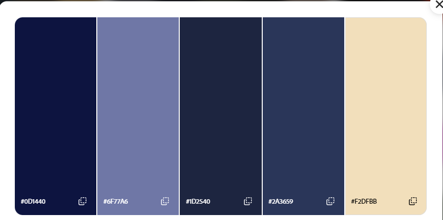
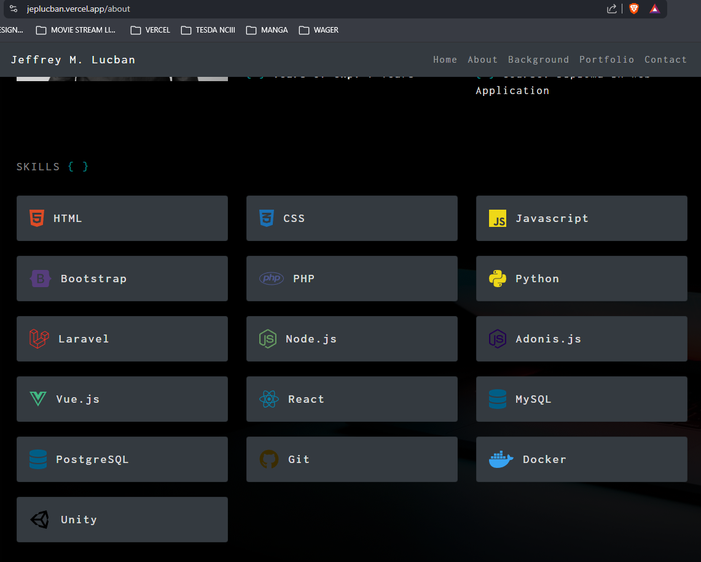

# Design Revamp Spec

### (Theme + Navigation + Interactivity — supersedes SPEC.md §6, activates SPEC.md §4)

This document specs a revamp of the portfolio's visual theme and navigation model. It does **not** change the underlying architecture — the component → hook → service → data pattern in `SPEC.md` §1–3 stays exactly as-is. In scope: color theme, page/navigation structure, and interactivity (motion).

**Why**: the current theme (`SPEC.md` §6) is a near-black dark navy that reads as flat and low-energy. The site is also currently one long scrolling page with no real navigation — `react-router-dom` is installed but unused, and `SPEC.md` §4 already documents exactly the routing pattern this revamp activates.

---

## 1. What's changing vs. what's not

| Changing | Not changing |
|---|---|
| Color tokens (dark navy → light, fresh, single theme) | Component/hook/service/data architecture (SPEC.md §1–3) |
| Navigation model (one long scroll → routed pages) | Icon set (Lucide stays) |
| Content grouping (Hero+Contact merge into one "Me" page) | Typography (Space Grotesk / Inter / JetBrains Mono stay) |
| Interactivity (adds Framer Motion) | Data files, hooks, services in `src/data`, `src/hooks`, `src/services` |

Explicitly **out of scope** (decided against during spec review):
- No light/dark toggle — **one theme only**.
- No "Fun" page and no separate Contact page/route — contact is folded into the Me page.
- No "Ask me anything" chat/AI input — dropped entirely.

---

## 2. Color tokens

Direction: **light, fresh, professional** — not another shade of dark, not a literal rainbow either. One theme, no toggle.

| Token | Old (SPEC §6.1) | New | Rationale |
|---|---|---|---|
| `--color-bg` | `#10131a` | `#F8F9FC` | Soft off-white — easier on the eyes than pure `#fff`, avoids the "too dark" complaint entirely |
| `--color-surface` | `#1a1f2b` | `#FFFFFF` | Cards/nav sit above `bg` via a soft shadow rather than a hard border |
| `--color-border` | `#2a303d` | `#E4E7F0` | Light hairline — visible but quiet |
| `--color-text` | `#e4e7ec` | `#1C1F2E` | Near-ink, strong contrast on the light background |
| `--color-text-muted` | `#8a93a6` | `#6B7280` | Cool gray, legible secondary text |
| `--color-accent` | `#4fd1c5` | `#0FB5A6` | Same brand teal family, deepened for contrast on a light background |
| `--color-accent-warm` | `#e8a54d` | `#F59E0B` | Same brand amber family, deepened for contrast |
| `--gradient-hero` *(new)* | — | soft blurred blend of `--color-accent`, `--color-accent-warm`, and one added soft blue `#7DD3FC` | A restrained nod to the reference screenshot's colorful gradient blob — stays on-brand (existing teal/amber) rather than a full rainbow, used once behind the Me page hero content |

```css
/* src/index.css — replaces SPEC §6.1/§6.4 tokens */
:root {
  --color-bg: #f8f9fc;
  --color-surface: #ffffff;
  --color-border: #e4e7f0;
  --color-text: #1c1f2e;
  --color-text-muted: #6b7280;
  --color-accent: #0fb5a6;
  --color-accent-warm: #f59e0b;
  --gradient-hero: radial-gradient(
    circle at 30% 20%,
    color-mix(in srgb, var(--color-accent) 35%, transparent),
    transparent 60%
  ),
  radial-gradient(
    circle at 70% 60%,
    color-mix(in srgb, var(--color-accent-warm) 30%, transparent),
    transparent 55%
  ),
  radial-gradient(
    circle at 50% 90%,
    color-mix(in srgb, #7dd3fc 30%, transparent),
    transparent 55%
  );
}
```

Cards move from "border only" (dark-theme convention) to a soft shadow + thin border combo, since flat borders read as weaker on light backgrounds:

```jsx
// was: bg-surface border border-border hover:border-accent
<div className="bg-surface border border-border rounded-xl p-6 shadow-sm hover:shadow-md hover:border-accent transition-all">
```

---

## 3. Navigation & page structure (activates SPEC.md §4)

The single long scroll becomes a **single-page app**: one HTML entry point, client-side routing between pages, no full reloads — this is still "single page" in the sense the user cares about, just page-switch instead of scroll.

**Routes** (`src/routes/router.jsx`, `createBrowserRouter`):

| Route | Page | Content |
|---|---|---|
| `/` | **Me** | Current Hero content + contact CTA folded in (email, GitHub, LinkedIn — no separate Contact route) |
| `/experience` | **Experience** | Current Experience section, as its own page |
| `/skills` | **Skills** | Current Skills section, as its own page |
| `/projects` | **Projects** | Current Projects section, as its own page |
| `*` | 404 | Simple not-found page |

**Structure** (per SPEC.md §4's already-documented pattern):
- `src/layouts/MainLayout.jsx` — Navbar + `<Outlet />` + Footer, shared across all routes.
- `src/pages/{Me,Experience,Skills,Projects}.jsx` — thin page wrappers rendering the existing `src/sections/...` components.
- `main.jsx` renders `<RouterProvider router={router} />` instead of `<App />` directly.

**Navbar**: reworked into rounded pill buttons with icon + label (matches the reference screenshot's bottom nav), using Lucide icons already in the project:

| Nav item | Icon |
|---|---|
| Me | `User` |
| Experience | `Briefcase` |
| Skills | `Layers` |
| Projects | `FolderKanban` |

```jsx
// src/components/layout/Navbar.jsx (concept)
import { NavLink } from "react-router-dom";
import { User, Briefcase, Layers, FolderKanban } from "lucide-react";

const links = [
  { to: "/", label: "Me", icon: User },
  { to: "/experience", label: "Experience", icon: Briefcase },
  { to: "/skills", label: "Skills", icon: Layers },
  { to: "/projects", label: "Projects", icon: FolderKanban },
];
```

---

## 4. Interactivity (Framer Motion)

Tone: **polished but professional** — noticeably more alive than the current fade-up-on-scroll, but restrained. No custom cursor, no tilt cards, no gimmicks.

- `npm install framer-motion`.
- New `src/lib/motionVariants.js` — shared variants (`fadeUp`, `staggerContainer`, `pageTransition`, `cardHover`) and one shared transition config (duration ~0.4–0.5s, easing `[0.22, 1, 0.36, 1]`) so motion feels consistent site-wide instead of ad hoc per component.

**Route transitions** — wrap `<Outlet />` in `AnimatePresence` so switching pages fades/slides rather than snapping:

```jsx
// src/layouts/MainLayout.jsx (concept)
<AnimatePresence mode="wait">
  <motion.div
    key={location.pathname}
    initial={{ opacity: 0, y: 8 }}
    animate={{ opacity: 1, y: 0 }}
    exit={{ opacity: 0, y: -8 }}
    transition={{ duration: 0.4, ease: [0.22, 1, 0.36, 1] }}
  >
    <Outlet />
  </motion.div>
</AnimatePresence>
```

**Navbar** — active pill slides between buttons via a shared layout animation instead of a plain color swap:

```jsx
{isActive && (
  <motion.span
    layoutId="nav-active-pill"
    className="absolute inset-0 bg-accent/10 rounded-full"
    transition={{ duration: 0.3, ease: [0.22, 1, 0.36, 1] }}
  />
)}
```

**Per-page motion**:
- **Me**: staggered entrance for name → role → tagline → contact links on load. Keep the existing CSS blinking cursor as-is — cheap, no need to move it to Framer.
- **Experience**: timeline items stagger-in via `whileInView` as the page mounts/scrolls.
- **Skills**: badges stagger-in (fade + slight scale); hover lift + accent-glow border.
- **Projects**: cards stagger-in by grid position; hover lift (`translateY(-4px)`) + border-color shift to accent + soft shadow glow; icon links get a small hover scale.

**Reduced motion**: replace the current CSS `prefers-reduced-motion` media query with Framer's `useReducedMotion()` hook, applied wherever variants are used, so the same guarantee holds under the new approach.

**Migration note**: `src/hooks/useScrollReveal.js` and the `.reveal` CSS class are superseded by Framer's `whileInView` + `viewport={{ once: true, amount: 0.2 }}` — remove them once every section that used `.reveal` (Skills, Experience, Projects) has been migrated.

---

## 5. Implementation checklist

- [ ] Update color tokens in `src/index.css` (new light palette + `--gradient-hero`)
- [ ] Add `src/layouts/MainLayout.jsx`, `src/pages/{Me,Experience,Skills,Projects}.jsx`, `src/routes/router.jsx`
- [ ] Update `main.jsx` to render `<RouterProvider router={router} />`
- [ ] Rework `Navbar` into icon+label pill buttons with animated active-pill indicator
- [ ] Fold contact links/CTA into the Me page
- [ ] `npm install framer-motion`; add `src/lib/motionVariants.js`
- [ ] Wrap `<Outlet />` in `AnimatePresence` for page transitions
- [ ] Replace `useScrollReveal` usages with Framer `whileInView` across Skills/Experience/Projects pages
- [ ] Add hover micro-interactions to Skill badges and Project cards
- [ ] Verify `prefers-reduced-motion` behavior via `useReducedMotion()`
- [ ] Remove now-unused `src/hooks/useScrollReveal.js` and `.reveal` CSS once migration is complete
- [ ] Prepare a list of ICONS like font-awesome, for adding skillset, tech stack, etc. But it SVG.
- [ ] Projects card must have a sample image/screenshot of the project
- [ ] Refer to this color palette
- [ ] For the skill section, refer to this image. Change text to ICONS.

 